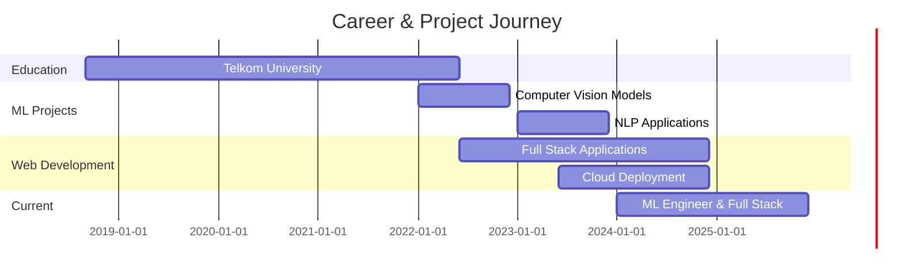

<div align="center">

<!-- Animated Wave Header -->


<!-- Typing Animation -->
<a href="https://git.io/typing-svg">
  
</a>

<!-- Stats & Badges -->
<p>
  
  
  
  
  
</p>

<!-- Social Links -->
<p>
  <a href="https://linkedin.com/in/luthfafi"></a>
  <a href="mailto:luthfafiwork@gmail.com"></a>
  <a href="https://github.com/mocitaz"></a>
</p>


</div>

##  About Me

```js
const luthfi = {
  name: 'Luthfi Fauzi',
  role: ['Machine Learning Engineer', 'Full Stack Developer'],
  education: 'Telkom University Graduate 🎓',
  location: 'Indonesia 🇮🇩',
  currentlyLearning: ['Advanced Deep Learning', 'System Design', 'Cloud Architecture'],
  funFact: 'I turn coffee into code ☕ → 💻',
  motto: 'Building the future, one algorithm at a time 🚀'
};
```

<div align="center">
  
</div>

##  Tech Stack

<table align="center">
<tr>
<td align="center" width="50%">

**🔥 Core & ML**


</td>
<td align="center" width="50%">

**🌐 Web & Cloud**


</td>
</tr>
<tr>
<td align="center" colspan="2">

**🗄️ Databases & Tools**


</td>
</tr>
</table>

<div align="center">
  
</div>

## 📊 GitHub Analytics

<div align="center">
  
  
</div>

<div align="center">
  
</div>

<div align="center">
  
</div>

<div align="center">
  
</div>

<div align="center">
  
</div>

<div align="center">
  
</div>

## 🎯 Current Focus

<table align="center">
<tr>
<td align="center" width="33%">
<br><b>Deep Learning</b><br>Neural Networks & AI Models
</td>
<td align="center" width="33%">
<br><b>Cloud Native</b><br>Microservices & Containers
</td>
<td align="center" width="33%">
<br><b>Full Stack</b><br>Modern Web Applications
</td>
</tr>
</table>

<div align="center">
  
</div>

## 🎵 Currently Vibing To

<div align="center">
  <a href="https://open.spotify.com/user/31k6qxq6zdvghfp4lzf2lh2gybmy">
    
  </a>
  <br><br>
  
</div>

<div align="center">
  
</div>

## 💼 Journey Timeline



<div align="center">
  
</div>

## 🏆 Achievements

<div align="center">

| 🎖️ Category | 📜 Achievement |
|:---:|:---|
| 🎓 | **Telkom University Graduate** - Computer Science |
| 🤖 | **Machine Learning Specialist** - Advanced AI/ML |
| 🌐 | **Full Stack Developer** - Modern Web Technologies |
| ☁️ | **Cloud Architecture** - AWS & GCP |
| 📊 | **Data Science** - Analytics & Visualization |

</div>

<div align="center">
  
</div>

## 💭 Random Dev Quote

<div align="center">
  
</div>

<div align="center">
  
</div>

## 🤝 Let's Connect!

<div align="center">

I'm always open to interesting conversations and collaboration opportunities!

<p>
  <a href="https://linkedin.com/in/luthfafi"></a>
  <a href="mailto:luthfafiwork@gmail.com"></a>
  <a href="https://github.com/mocitaz"></a>
</p>

</div>

---

<div align="center">

<!-- Footer Wave -->


<p>
  
  
  
</p>

<p>
  
  <b>Keep Learning, Keep Building, Keep Innovating!</b>
  
</p>

<p>
  
</p>

</div>
