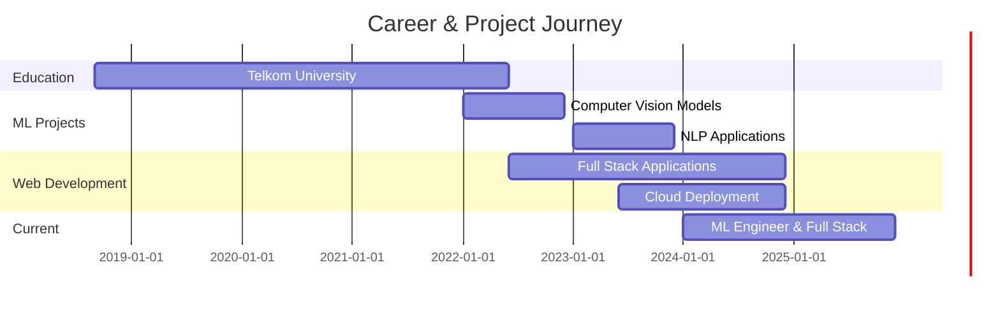

<div align="center">

<!-- Animated Wave Header -->


<!-- Typing Animation --><div align="center">

<!-- === HEADER === -->


<a href="https://git.io/typing-svg">
  
</a>


<!-- Stats / Badges -->

<p>
  
  
  
  
  
</p>

<!-- Socials -->

<p>
  <a href="https://linkedin.com/in/luthfafi"></a>
  <a href="mailto:luthfafiwork@gmail.com"></a>
  <a href="https://github.com/mocitaz"></a>
</p>


</div>

<!-- === QUICK NAV === -->

<details>
<summary><b>📌 Quick Navigation</b></summary>

* [About Me](#-about-me)
* [Tech Stack & Skills](#-tech-stack--skills)
* [GitHub Analytics](#-github-analytics)
* [Current Focus Areas](#-current-focus-areas)
* [Coding Activity](#-coding-activity)
* [Achievements & Certifications](#-achievements--certifications)
* [Work Experience & Projects Timeline](#-work-experience--projects-timeline)
* [Currently Vibing To](#-currently-vibing-to)
* [Connect](#-lets-connect)

</details>

---

##  About Me

```js
const luthfi = {
  name: 'Luthfi Fauzi',
  role: ['Machine Learning Engineer', 'Full Stack Developer'],
  education: 'Telkom University Graduate 🎓',
  location: 'Indonesia 🇮🇩',
  currentlyLearning: ['Advanced Deep Learning', 'System Design', 'Cloud Architecture'],
  funFact: 'I turn coffee into code ☕ → 💻',
  motto: 'Building the future, one algorithm at a time 🚀'
};
```

<div align="center">
  
</div>

##  Tech Stack & Skills

<details open>
<summary><b>🔥 Core Languages</b></summary>
<br>
<p align="center">
  
  
  
  
  
  
</p>
</details>

<details open>
<summary><b>🤖 Machine Learning & AI</b></summary>
<br>
<p align="center">
  
  
  
  
  
  
  
</p>
</details>

<details open>
<summary><b>🌐 Web Development</b></summary>
<br>
<p align="center">
  
  
  
  
  
  
</p>
</details>

<details open>
<summary><b>☁️ Cloud & DevOps</b></summary>
<br>
<p align="center">
  
  
  
  
  
  
</p>
</details>

<details open>
<summary><b>🗄️ Databases</b></summary>
<br>
<p align="center">
  
  
  
  
</p>
</details>

<div align="center">
  
</div>

## 📊 GitHub Analytics

<div align="center">
  
  
</div>

<div align="center">
  
</div>

<div align="center">
  
</div>

<div align="center">
  
</div>

<div align="center">
  
</div>

<div align="center">
  
</div>

## 🎯 Current Focus Areas

<table align="center">
<tr>
<td align="center" width="33%">
<br><b>Deep Learning</b><br>Neural Networks & AI Models
</td>
<td align="center" width="33%">
<br><b>Cloud Native</b><br>Microservices & Containers
</td>
<td align="center" width="33%">
<br><b>Full Stack</b><br>Modern Web Applications
</td>
</tr>
</table>

<div align="center">
  
</div>

## 🎵 Currently Vibing To

<div align="center">
  
</div>

<div align="center">
  
</div>

## 💼 Work Experience & Projects Timeline



<div align="center">
  
</div>

## 📈 Coding Activity

<div align="center">

<!--START_SECTION:waka-->


<!--END_SECTION:waka-->

</div>

<div align="center">
  
</div>

<div align="center">
  
</div>

## 🏆 Achievements & Certifications

<div align="center">

| 🎖️ Category | 📜 Achievement                                     |
| :----------: | :------------------------------------------------- |
|      🎓      | **Telkom University Graduate** — Computer Science  |
|      🤖      | **Machine Learning Specialist** — Advanced AI/ML   |
|      🌐      | **Full Stack Developer** — Modern Web Technologies |
|      ☁️      | **Cloud Architecture** — AWS & GCP                 |
|      📊      | **Data Science** — Analytics & Visualization       |

</div>

<div align="center">
  
</div>

## 💭 Random Dev Quote

<div align="center">
  
</div>

## 📊 Additional Stats

<div align="center">
  <a href="https://github.com/mocitaz"></a>
  
  
  
  
</div>

## 🤝 Let's Connect!

<div align="center">
  I'm always open to interesting conversations and collaboration opportunities!
  <p>
    <a href="https://linkedin.com/in/luthfafi"></a>
    <a href="mailto:luthfafiwork@gmail.com"></a>
    <a href="https://github.com/mocitaz"></a>
  </p>
</div>

---

<div align="center">

<!-- === FOOTER === -->


<p>
  
  
  
</p>

<p align="center">
  
</p>

</div>

<a href="https://git.io/typing-svg"></a>

<!-- Animated Profile Frame -->


<!-- Visitor Counter & Badges -->
<p>
  
  
  
  
</p>

<!-- Social Links -->
<p>
  <a href="https://linkedin.com/in/luthfafi">
    
  </a>
  <a href="mailto:luthfafiwork@gmail.com">
    
  </a>
  <a href="https://github.com/mocitaz">
    
  </a>
</p>

<!-- Divider -->


</div>

##  About Me

const luthfi = {
    name: "Luthfi Fauzi",
    role: ["Machine Learning Engineer", "Full Stack Developer"],
    education: "Telkom University Graduate 🎓",
    location: "Indonesia 🇮🇩",
    currentlyLearning: ["Advanced Deep Learning", "System Design", "Cloud Architecture"],
    funFact: "I turn coffee into code ☕ → 💻",
    motto: "Building the future, one algorithm at a time 🚀"
};

<div align="center">

</div>

##  Tech Stack &amp; Skills

<details open>
<summary><b>🔥 Core Languages</b></summary>
<br>
<p align="center">
  
  
  
  
  
  
</p>
</details>

<details open>
<summary><b>🤖 Machine Learning &amp; AI</b></summary>
<br>
<p align="center">
  
  
  
  
  
  
  
</p>
</details>

<details open>
<summary><b>🌐 Web Development</b></summary>
<br>
<p align="center">
  
  
  
  
  
  
</p>
</details>

<details open>
<summary><b>☁️ Cloud &amp; DevOps</b></summary>
<br>
<p align="center">
  
  
  
  
  
  
</p>
</details>

<details open>
<summary><b>🗄️ Databases</b></summary>
<br>
<p align="center">
  
  
  
  
</p>
</details>

<div align="center">

</div>

## 📊 GitHub Analytics

<div align="center">
  
  
</div>

<div align="center">
  
</div>

<div align="center">
  
</div>

<div align="center">
  
</div>

<div align="center">
  
</div>

<div align="center">

</div>

## 🎯 Current Focus Areas

<table align="center">
<tr>
<td align="center" width="33%">

<br><strong>Deep Learning</strong>
<br>Neural Networks &amp; AI Models
</td>
<td align="center" width="33%">

<br><strong>Cloud Native</strong>
<br>Microservices &amp; Containers
</td>
<td align="center" width="33%">

<br><strong>Full Stack</strong>
<br>Modern Web Applications
</td>
</tr>
</table>

<div align="center">

</div>

## 🎵 Currently Vibing To

<div align="center">
  
</div>

<div align="center">

</div>

## 💼 Work Experience &amp; Projects Timeline

gantt
    title Career & Project Journey
    dateFormat  YYYY-MM
    section Education
    Telkom University           :2018-09, 2022-06
    section ML Projects
    Computer Vision Models      :2022-01, 2022-12
    NLP Applications           :2023-01, 2023-12
    section Web Development
    Full Stack Applications    :2022-06, 2024-12
    Cloud Deployment          :2023-06, 2024-12
    section Current
    ML Engineer & Full Stack   :2024-01, 2025-12

<div align="center">

</div>

## 📈 Coding Activity

<div align="center">
  
<!--START_SECTION:waka-->


<!--END_SECTION:waka-->

</div>

<div align="center">
  
</div>

<div align="center">

</div>

## 🏆 Achievements &amp; Certifications

<div align="center">

| 🎖️ Category | 📜 Achievement |
|:---:|:---|
| 🎓 | **Telkom University Graduate** - Computer Science |
| 🤖 | **Machine Learning Specialist** - Advanced AI/ML |
| 🌐 | **Full Stack Developer** - Modern Web Technologies |
| ☁️ | **Cloud Architecture** - AWS &amp; GCP |
| 📊 | **Data Science** - Analytics &amp; Visualization |

</div>

<div align="center">

</div>

## 🤝 Let's Connect!

<div align="center">

I'm always open to interesting conversations and collaboration opportunities!

<p>
  <a href="https://linkedin.com/in/luthfafi">
    
  </a>
  <a href="mailto:luthfafiwork@gmail.com">
    
  </a>
  <a href="https://github.com/mocitaz">
    
  </a>
</p>

</div>

<div align="center">

</div>

## ☕ Support My Work

<div align="center">

If you like my work and want to support me, consider buying me a coffee! ☕

<a href="https://www.buymeacoffee.com/luthfifauzi" target="_blank">
  
</a>

<p>
  
  
</p>

</div>

<div align="center">

</div>

## 💭 Random Dev Quote

<div align="center">
  


</div>

<div align="center">

</div>

## 📊 Additional Stats

<div align="center">
  
<a href="https://github.com/mocitaz">
  
</a>


</div>

<div align="center">

---

<!-- Footer Wave -->


<p>
  
  
  
</p>

<p align="center">
  
  <b>Keep Learning, Keep Building, Keep Innovating!</b>
  
</p>

<p align="center">
  
</p>

</div>
