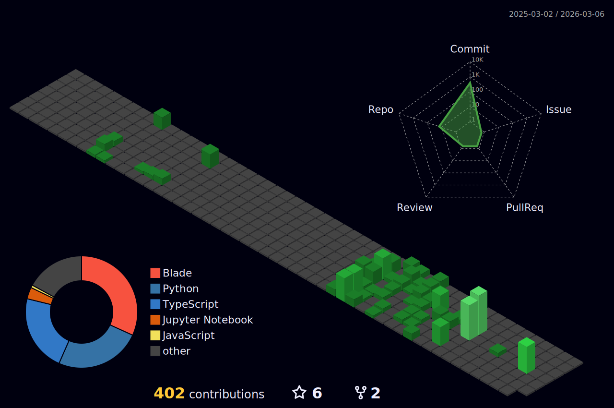

<!-- BLACK & WHITE MINIMALIST THEME -->
<!-- Crafted with ❤️ by Luthfi Fauzi -->

<div align="center">
  <!-- NEW HEADER STYLE: Soft with Gradient & Twinkling Animation (Cyberpunk/Space Vibe) -->
  
  
  <h1>
    <!-- Typing SVG with Glitch Effect font -->
    
  </h1>
  
  <p>
    
  </p>

  <br/>

  <!-- PORTFOLIO CTA (NEW) -->
  <a href="https://luthfafiworks.my.id/" target="_blank">
    
  </a>
  <br/>
  <a href="https://luthfafiworks.my.id/" target="_blank">
    
  </a>

  <br/><br/>

  <!-- Socials -->
  <p>
    <a href="https://linkedin.com/in/luthfafi">
      
    </a>
    <a href="https://github.com/mocitaz">
      
    </a>
    <a href="mailto:luthfafiwork@gmail.com">
      
    </a>
    <a href="https://instagram.com/luthfifi_">
      
    </a>
  </p>
</div>

<br/>
<br/>

### 👨‍💻 About Me

```python
class LuthfiFauzi:
    def __init__(self):
        self.username = "mocitaz"
        self.role = "Machine Learning Engineer"
        self.location = "Indonesia 🇮🇩"
        self.graduation = "November 2025 🎓"
        self.code = ["Python", "TypeScript", "C++"]
        self.ask_me_about = ["Generative AI", "Cloud Arch", "Scalable Systems"]

    def fun_fact(self):
        return "I train neural networks and they train my patience."

# Initialize the developer
me = LuthfiFauzi()
print(me.fun_fact())
```

<div align="center">
  <!-- Interactive Weather Widget (Real-time) -->
  
</div>

<!-- DYNAMIC QUOTE (Refined for 'Extraordinary' vibes) -->
<div align="center">
  
  <br/>
  
</div>

<br/>

### 🛠️ Tech Stack

<div align="center">
  
  <br/><br/>
  
  <br/><br/>
  
  <br/><br/>
  
  <br/><br/>
  
</div>

<br/>
<br/>

<!-- GITHUB ANALYTICS START -->
### 📊 GitHub Analytics

<div align="center">
  
  <!-- 3D Isometric Contribution Graph (The "Architectural" Visuals) -->
  
  <br/>

  <!-- Flat Activity Graph (Classic) -->
  
  
  <br/><br/>
  
  <!-- Alternative Stats (Using Profile Summary Cards because Readme-Stats is currently flaky) -->
  <!-- Productive Time -->
  
  
  <!-- Profile Details -->
  

</div>
<!-- GITHUB ANALYTICS END -->

<br/>
<br/>

<div align="center">
  
  <br/>
  
  <!-- VISITOR COUNTER (Cyberpunk/Retro Style) -->
  
  
  <p>© 2025 Luthfi Fauzi • Built with 🖤</p>
</div>
